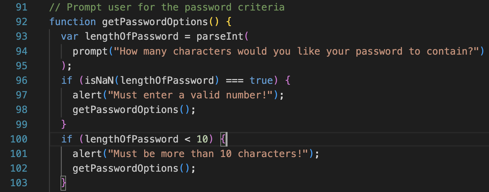
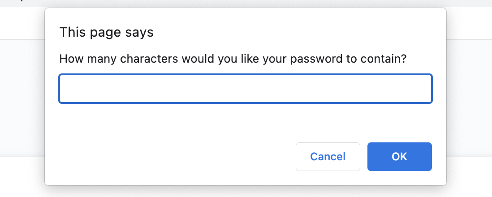
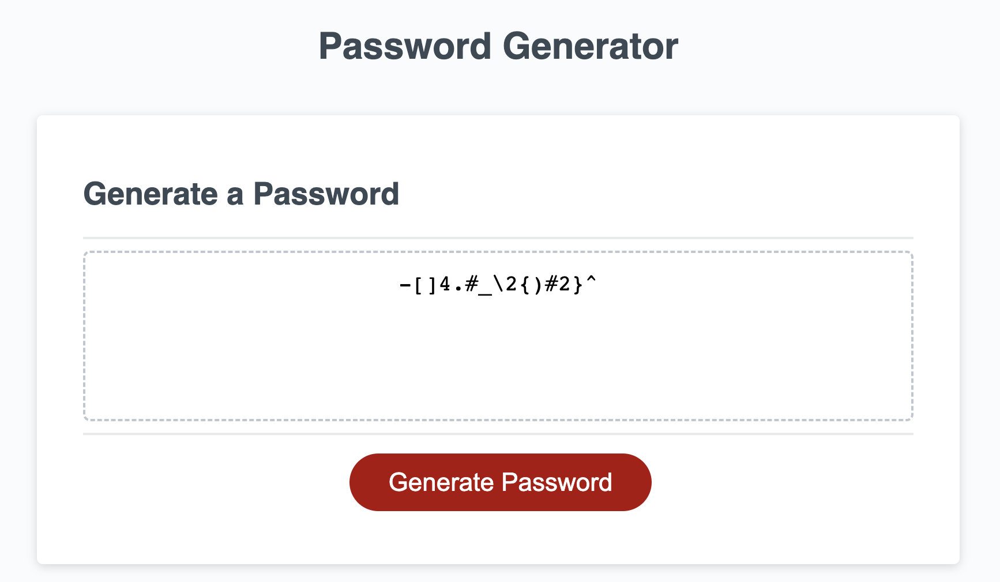
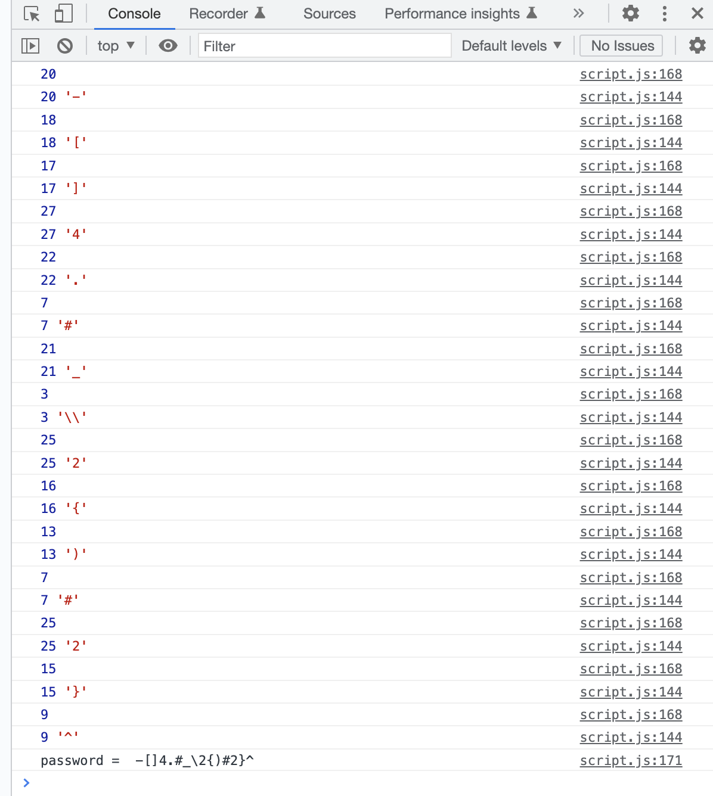

# Module 5 Challenge: Password Generator

## Overview
 
This week’s challenge requires you to create an application that an employee can use to generate a random password based on criteria they’ve selected by modifying starter code. This app will run in the browser, and will feature dynamically updated HTML and CSS powered by JavaScript code that you write. It will have a clean and polished user interface that is responsive, ensuring that it adapts to multiple screen sizes.

The password can include special characters. If you’re unfamiliar with these, see this [list of Password Special Characters from the OWASP Foundation](https://www.owasp.org/index.php/Password_special_characters).

## Instructions

The following image shows the web application's appearance and functionality:

* Generate a password when the button is clicked
  * Present a series of prompts for password criteria
    * Length of password
      * At least 10 characters but no more than 64.
    * Character types
      * Lowercase
      * Uppercase
      * Numeric
      * Special characters ($@%&*, etc)
  * Code should validate for each input and at least one character type should be selected
  * Once prompts are answered then the password should be generated and displayed in an alert or written to the page

**What i learned from completing this project:**

The image below displays in VS code the inital prompt a user will get when ***generate button*** is clicked.

The image below displays in the browser the initial prompts a user will get when ***generate button*** is clicked. Once the user has selected the amount of characters that they would want (only between 10-64) if the user selects below 10 or over 64 characters the code will alert a message explaining must be more than 10 or less than 64. 

The browser will then deliver more prompts alerting the user to ensure they use special characters, numeric characters, lower cased characters and upper cased characters. Once the prompts have been confirmed a random password will be generated.

The image below displays the password that is generated once the user has selected how many characters they would like to use in the password. 

The image below shows what the console logs once the password in generated. 

## GitHub

https://github.com/bex-ford/module-5

## Licence 

NONE
---

